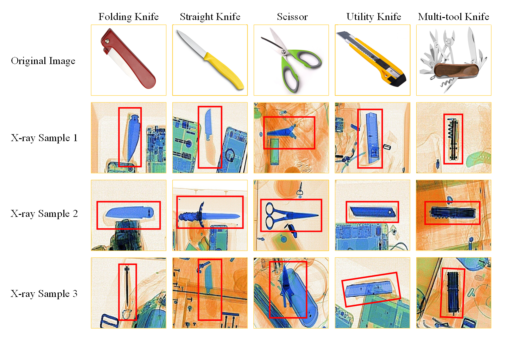
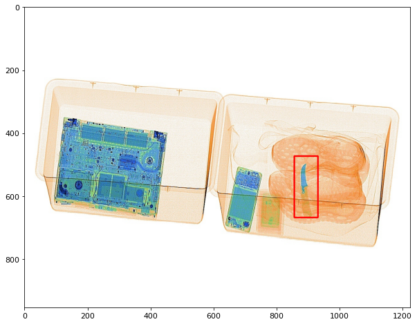
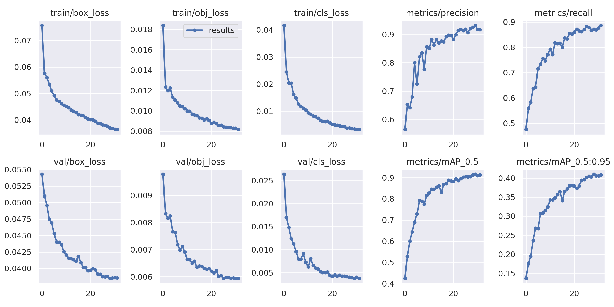
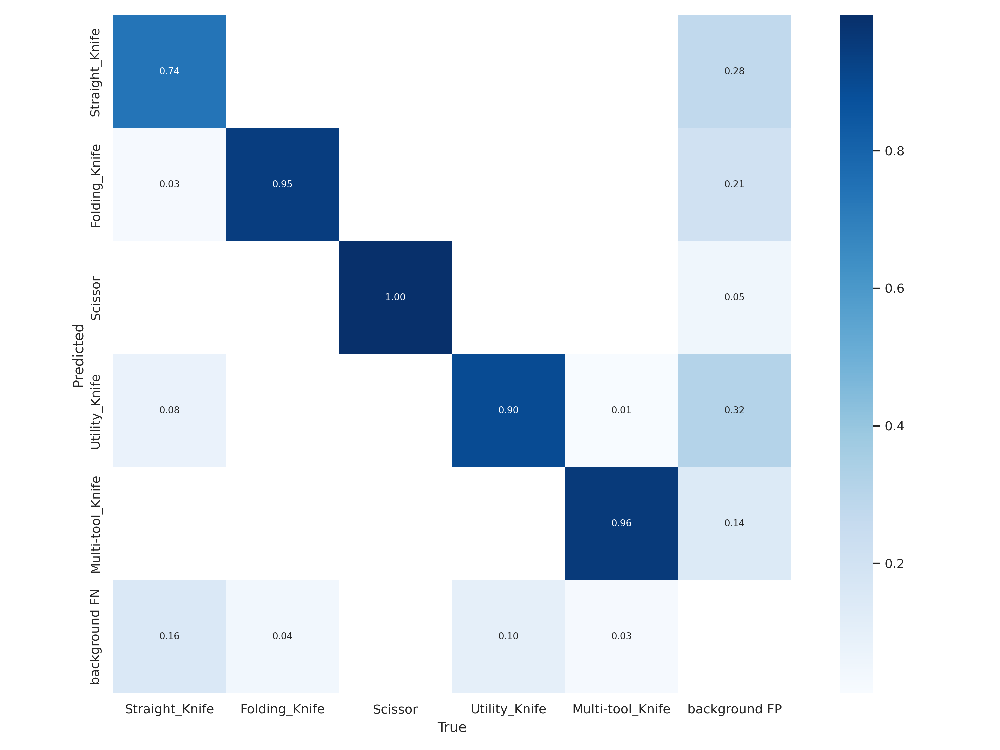
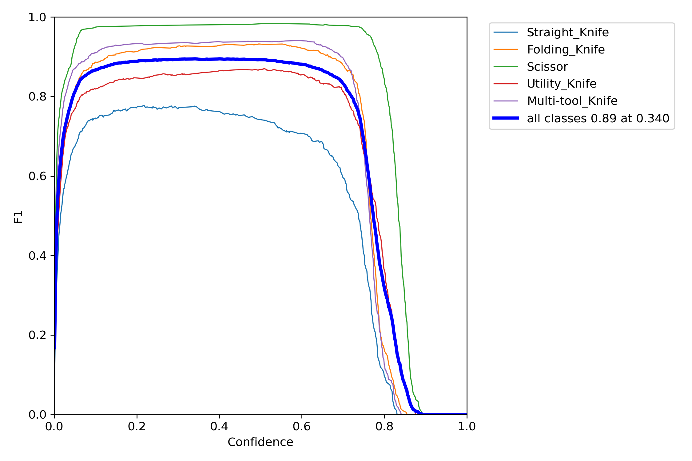
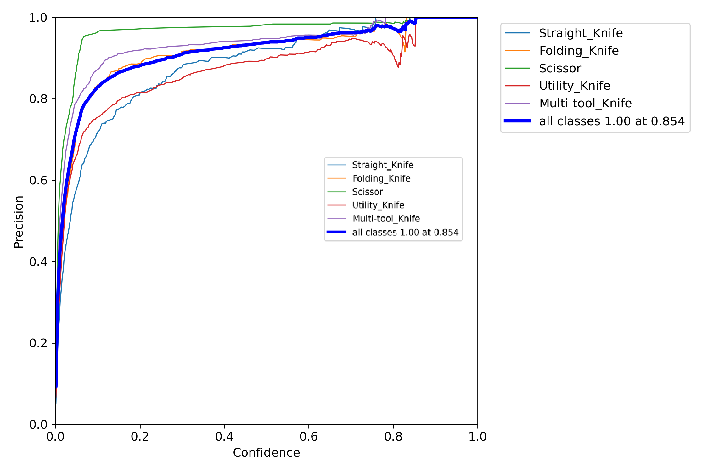
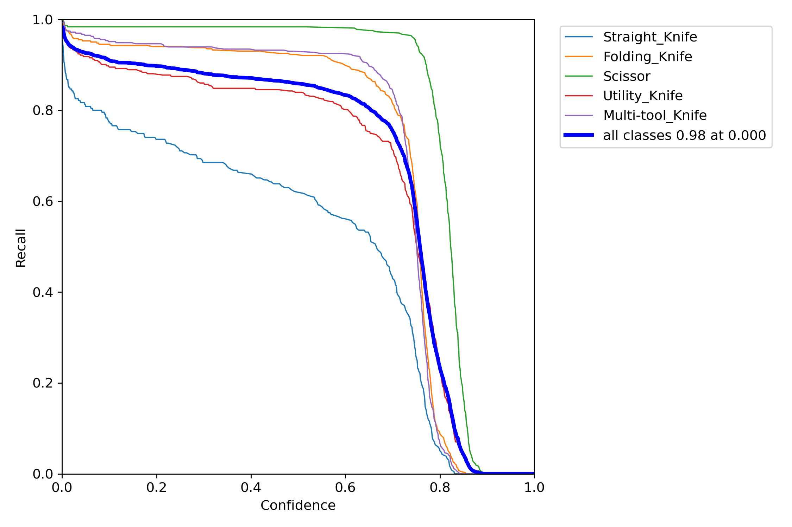
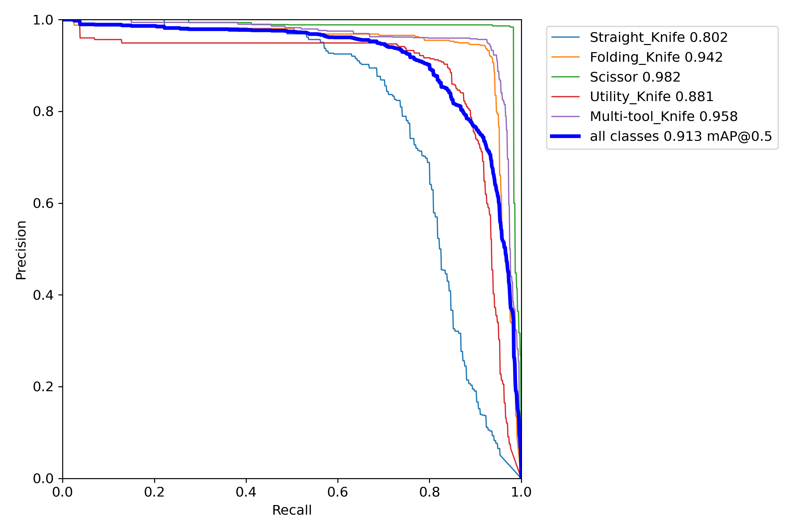

# master-diploma

## Overview
Этот проект разрабатывался в рамках дипломной работы.
Задача состояла в том, чтобы обучить нейронную сеть детектировать запрещенные предметы на рентгеновских снимках багажа.
В качестве детектора использовалась нейронная сеть YOLOv5. 

## Данные
Для решения задачи был использовае высококачественный набор данных для обнаружения запрещенных рентгеновских объектов под названием OPIXray, который содержит 8885 рентгеновских изображений 5 категорий широко распространенных запрещенных предметов – «режущих предметов». Изображения собраны в аэропорту, и аннотированы вручную профессиональными инспекторами.

<a href="https://github.com/OPIXray-author/OPIXray">Ссылка на датасет</a>

<a href="https://github.com/ultralytics/yolov5">Ссылка на репозиторий YOLOv5</a>

### OPIXray dataset

    

## Предсказание модели

    

## Результаты

    

### Confusion matrix

    

### F1

    

### Precision

    

### Recall

    

### PR_curve

    

